# Integrated Pizza ERP System (Odoo 18)

Giải pháp quản trị doanh nghiệp toàn diện (End-to-End) dành cho lĩnh vực F&B, quản lý toàn bộ chuỗi cung ứng từ khâu nhập nguyên liệu đến sản xuất và giao hàng cuối (Last-mile delivery).

## Giải pháp trọng tâm

*   **Sản xuất dựa trên định mức (BoM):** Quy trình sản xuất tự động hóa dựa trên định mức nguyên vật liệu (Bill of Materials), tích hợp kiểm tra chất lượng (QC) và quản lý phế phẩm/hỏng hóc (Scrap).
*   **Quản lý kho thông minh (FEFO):** Hệ thống quản trị kho tiên tiến áp dụng quy tắc **First-Expired-First-Out** (Hết hạn trước - Xuất trước) kèm cảnh báo hạn sử dụng theo thời gian thực.
*   **Vận hành Giao nhận & PoD:** Tự động hóa khâu điều phối tài xế theo tuyến đường. Ứng dụng xác thực giao hàng **Proof of Delivery (PoD)** tích hợp chữ ký số và hình ảnh thực tế.
*   **Phân tích dữ liệu chuyên sâu:** Thiết kế các **SQL Views** hiệu suất cao để trích xuất báo cáo đa chiều về Định giá tồn kho, Xu hướng bán hàng và Đối soát tài chính (COD).

## Bộ công nghệ 

*   **Framework:** Odoo 18 
*   **Language:** Python, XML 
*   **Database:** PostgreSQL

## Hướng dẫn cài đặt

1. Sao chép thư mục dự án vào thư mục `custom_addons` trong bộ mã nguồn Odoo của bạn.
2. Cài đặt các thư viện cần thiết:
   ```bash
   pip install -r requirements.txt

## Sơ đồ BPMN 
BPMN là một phương pháp biểu đồ luồng (Flow chart), tập hợp các ký hiệu chuẩn dùng để mô hình hóa quy trình của doanh nghiệp. 
Thông qua BPMN, các bên liên quan sẽ đồng nhất hơn với nhau trong việc thiết kế và triển khai quy trình nghiệp vụ.
## Sơ đồ BPMN Module quản lý vận hành _Nhập nguyên liệu


## Sơ đồ BPMN Module quản lý vận hành _Lưu kho & quản lý nguyên liệu


## Sơ đồ BPMN Module quản lý vận hành _Sản xuất pizza


## Sơ đồ BPMN Module quản lý vận hành _Bán hàng pizza


## Sơ đồ BPMN Module quản lý vận hành _Kiểm soát và hủy hàng 


## Sơ đồ BPMN_Module quản lý đội ngũ giao hàng Pizza


---
## 🗄️ Quan hệ giữa các bảng

Hệ thống được thiết kế dựa trên mô hình quan hệ (Relational Database). Dưới đây là mô tả các mối quan hệ chính thể hiện trong sơ đồ ERD:

### 📥 Nhóm Mua hàng 
- **pizza_procurement_request (1) --- (N) pizza_procurement_line**: Một phiếu yêu cầu chứa nhiều dòng chi tiết nguyên liệu. Đây là quan hệ cha-con (Composition), nếu phiếu bị xóa, các dòng chi tiết cũng bị xóa theo.
- **res_partner (1) --- (N) pizza_procurement_request**: Một nhà cung cấp có thể nhận nhiều phiếu yêu cầu mua hàng khác nhau.

### 🍕 Nhóm Sản xuất 
- **pizza_production_order (1) --- (N) pizza_production_line**: Một lệnh sản xuất bao gồm nhiều dòng nguyên liệu tiêu hao (Lấy từ BOM).
- **pizza_production_order (N) --- (1) product_product**: Nhiều lệnh sản xuất có thể cùng làm ra một loại Pizza.
- **pizza_production_order (1) --- (N) pizza_scrap_record**: Một lệnh sản xuất có thể phát sinh nhiều biên bản hủy hàng (do cháy, hỏng).

### 🛒 Nhóm Bán hàng 
- **pizza_sales_order (1) --- (N) pizza_sales_line**: Một đơn hàng bán bao gồm nhiều món ăn chi tiết.
- **res_partner (1) --- (N) pizza_sales_order**: Một khách hàng có thể thực hiện nhiều đơn đặt hàng.

### 📦 Nhóm Kho & Sản phẩm 
- **product_template (1) --- (N) product_product**: Một mẫu sản phẩm (Template) có thể có nhiều biến thể (Variant).
- **product_product (1) --- (N) stock_lot**: Một sản phẩm được quản lý theo nhiều Lô hàng khác nhau để theo dõi hạn sử dụng riêng biệt.
- **product_product (1) --- (N) [All Line Tables]**: Sản phẩm là trung tâm, liên kết (1-N) với tất cả các bảng chi tiết (Mua, Bán, Sản xuất, Hủy) để định danh đối tượng đang được xử lý.

### 🛵 Nhóm Giao vận & Logistics (Delivery)
- **pizza_sales_order (1) --- (N) pizza_delivery_order**: Đây là mối quan hệ cầu nối giữa Bán hàng và Giao vận. Một đơn bán hàng có thể phát sinh nhiều phiếu giao hàng (ví dụ: Lần 1 giao thất bại, tạo phiếu lần 2 để giao lại). Tuy nhiên, thông thường là quan hệ 1-1.
- **pizza_driver (1) --- (N) pizza_delivery_order**: Một tài xế có thể thực hiện nhiều đơn giao hàng khác nhau theo thời gian (Lịch sử giao hàng). Mỗi phiếu giao hàng tại một thời điểm chỉ được gán cho 1 tài xế chịu trách nhiệm.
- **pizza_delivery_route (1) --- (N) pizza_delivery_order**: Các đơn giao hàng được gom nhóm vào các Tuyến đường/Khu vực cụ thể để tiện cho việc điều phối.
- **pizza_driver (N) --- (N) pizza_delivery_route**: Đây là quan hệ Nhiều - Nhiều (Many-to-Many). Một tài xế có thể thông thạo và phụ trách nhiều tuyến đường (VD: Chạy cả Quận 1 và Quận 3). Một tuyến đường có thể có nhiều tài xế cùng hoạt động. Trong cơ sở dữ liệu, quan hệ này được hiện thực hóa bằng bảng trung gian `pizza_delivery_route_pizza_driver_rel`.
- **res_partner (1) --- (1) pizza_driver**: Mỗi hồ sơ tài xế được liên kết chặt chẽ với một `res.partner` (User hệ thống) để quản lý thông tin đăng nhập, số điện thoại và ảnh đại diện.
- **pizza_driver (1) --- (N) pizza_driver_leave_request**: Một tài xế có thể tạo nhiều phiếu yêu cầu nghỉ phép trong quá trình làm việc. Khi phiếu được duyệt (approved), trạng thái của tài xế sẽ tự động chuyển sang offline.
---


## Sơ đồ thực thể liên kết (ERD)
Sơ đồ dưới đây thể hiện sự liên kết giữa các module thông qua các bảng trung tâm như product_product và res_partner.

```mermaid
erDiagram
    %% ======================================================
    %% 1. NHÓM ĐỐI TÁC VÀ TÀI XẾ (PARTNERS & DRIVERS)
    %% ======================================================
    res_partner ||--o{ pizza_procurement_request : "vendor_id"
    res_partner ||--o{ pizza_sales_order : "customer_id"
    res_partner ||--|| pizza_driver : "user_id"

    res_partner {
        integer id PK
        varchar name
        boolean supplier_rank
        boolean customer_rank
    }

    pizza_driver ||--o{ pizza_delivery_order : "driver_id"
    pizza_driver ||--o{ pizza_driver_leave_request : "driver_id"
    pizza_driver }|..|{ pizza_delivery_route_rel : "rel_id"

    pizza_driver {
        integer id PK
        varchar name
        integer partner_id FK
        integer vehicle_id
        varchar license_plate
        varchar state "available, busy, offline"
    }

    pizza_driver_leave_request {
        integer id PK
        varchar name
        integer driver_id FK
        date date_from
        date date_to
        text reason
        varchar state
    }

    %% ======================================================
    %% 2. NHÓM SẢN PHẨM VÀ KHO (PRODUCTS & STOCK)
    %% ======================================================
    product_template ||--o{ product_product : "1:N"
    product_product ||--o{ stock_lot : "1:N (lot tracking)"
    product_product ||--o{ pizza_procurement_line : "product_id"
    product_product ||--o{ pizza_production_line : "raw_material_id"
    product_product ||--o{ pizza_production_order : "finished_good_id"
    product_product ||--o{ pizza_sales_line : "product_id"
    product_product ||--o{ pizza_scrap_record : "product_id"

    product_template {
        integer id PK
        varchar name
        varchar storage_category "dry, cool, frozen"
        boolean check_expiry
        integer shelf_life "Total days"
        timestamp inspection_date
    }

    product_product {
        integer id PK
        integer product_tmpl_id FK
        varchar default_code
    }

    stock_lot {
        integer id PK
        varchar name
        integer product_id FK
        timestamp expiration_date "Hạn dùng (Tự động)"
    }

    %% ======================================================
    %% 3. NHÓM MUA HÀNG (PROCUREMENT)
    %% ======================================================
    pizza_procurement_request ||--o{ pizza_procurement_line : "1:N"

    pizza_procurement_request {
        integer id PK
        varchar name "Mã phiếu"
        integer vendor_id FK "NCC (res_partner)"
        integer warehouse_id
        date date_planned
        varchar state
    }

    pizza_procurement_line {
        integer id PK
        integer request_id FK
        integer product_id FK "Nguyên liệu"
        double qty
        varchar storage_category "Lưu kho"
    }

    %% ======================================================
    %% 4. NHÓM SẢN XUẤT (PRODUCTION / MRP)
    %% ======================================================
    pizza_production_order ||--o{ pizza_production_line : "1:N"
    pizza_production_order ||--o{ pizza_scrap_record : "1:N"
    pizza_production_order }o--|| mrp_bom : "uses"

    pizza_production_order {
        integer id PK
        varchar name
        integer product_id FK "Thành phẩm"
        integer bom_id FK "Công thức (mrp_bom)"
        double qty_producing
        integer location_src_id "Kho Nguyên liệu"
        integer location_dest_id "Kho Thành phẩm"
        varchar state
    }

    pizza_production_line {
        integer id PK
        integer production_id FK
        integer product_id FK "Nguyên liệu tiêu hao"
        double qty_needed
    }

    pizza_scrap_record {
        integer id PK
        integer production_id FK "Từ Lệnh SX nào"
        integer product_id FK "Sản phẩm lỗi"
        double qty
        varchar reason "Lý do (Cháy/Hỏng...)"
    }

    mrp_bom {
        integer id PK
        varchar code
    }

    %% ======================================================
    %% 5. NHÓM BÁN HÀNG VÀ GIAO VẬN (SALES & DELIVERY)
    %% ======================================================
    pizza_sales_order ||--o{ pizza_sales_line : "1:N"
    pizza_sales_order ||--o{ pizza_delivery_order : "1:N (Tạo phiếu)"
    pizza_delivery_route ||--o{ pizza_delivery_order : "route_id"
    pizza_delivery_route }|..|{ pizza_delivery_route_rel : "rel_id"

    pizza_sales_order {
        integer id PK
        varchar name
        integer customer_id FK "Khách (res_partner)"
        varchar order_type "Dine-in / Delivery"
        date date
        double amount_total
    }

    pizza_sales_line {
        integer id PK
        integer order_id FK
        integer product_id FK "Món ăn"
        double qty
    }

    pizza_delivery_order {
        integer id PK
        varchar name "Mã vận đơn"
        integer sales_order_id FK "Đơn gốc"
        integer customer_id FK
        integer driver_id FK "Tài xế"
        integer route_id FK "Tuyến đường"
        varchar address
        double amount_cod "Tiền thu hộ"
        varchar state "draft, delivering, done, fail"
        integer priority
    }

    pizza_delivery_route {
        integer id PK
        varchar name "Tên vùng/tuyến"
        varchar code
        double estimated_shipping_fee
    }

    pizza_delivery_route_rel {
        integer route_id FK
        integer driver_id FK
    }
```



## Giao diện 


## Giao diện ứng dụng của Module quản lý vận hành _Nhập nguyên liệu


## Giao diện ứng dụng của Module quản lý vận hành _ Lưu kho & quản lý nguyên liệu


## Giao diện ứng dụng của Module quản lý vận hành _ Sản xuất pizza


## Giao diện ứng dụng của Module quản lý vận hành _ Bán hàng pizza


## Giao diện ứng dụng của Module quản lý vận hành _ Kiểm soát và hủy hàng


## Giao diện ứng dụng của Module quản lý vận hành _ Báo cáo


